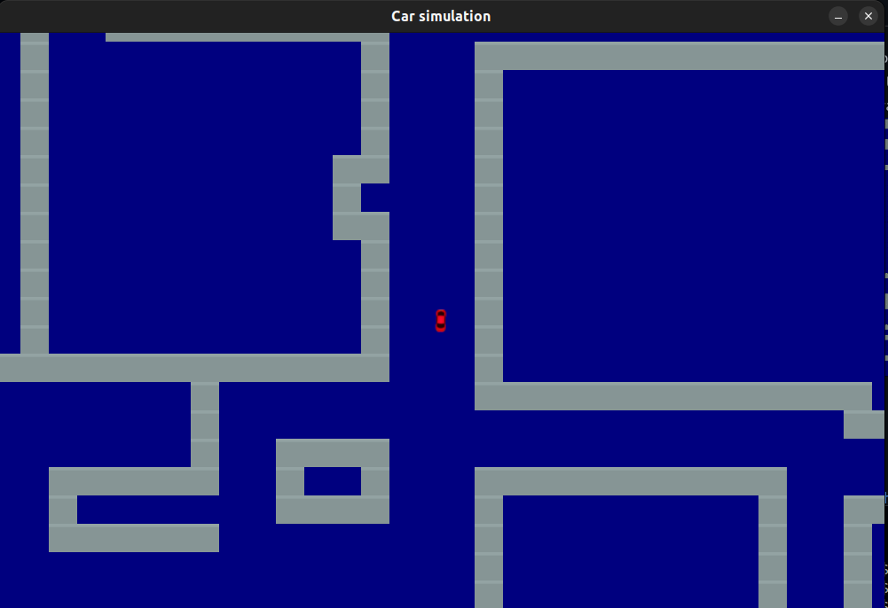
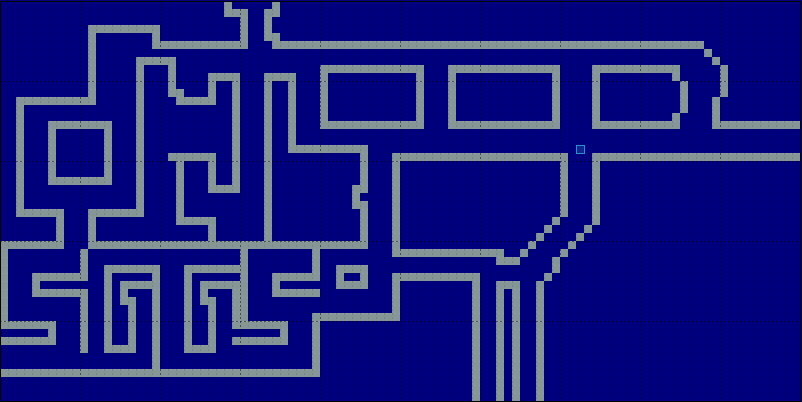

# This is a Car simulation build using Arcade.

The main purpose of this project is to create an environment where we can control a car and simulate things like roads, obsticles the car will face and this will be later used to train car drive automatically.

Required:

1. Python 3.10.6
2. arcade 2.6.17   

To Download python visit
https://www.python.org/downloads/

To install arcade

`
pip install arcade
`

To run game go to /car-simluation dir and just run

`
python main.py
`

Map of the Simulation 
